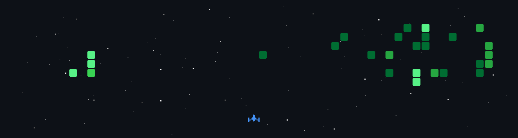

<p align="center">
<sub>// WORLD LINE: <span style="color:#05D9E8">1.048596</span> // STEINS GATE CONFIRMED //</sub>
</p>

<p align="center">

</p>

---

<div align="center">

```bash
> BOOT_SEQUENCE: QUANTUM_LAB v7.0
> world_line.set(1.048596) ........... [OK]
> entangled_pair.establish() ......... [OK]
> link_start.exe ..................... [OK]
> psyche.kernel ...................... [OK]
> welcome_to_night_city .............. [OK]
> SYSTEM ONLINE :: WELCOME, SANYAM.
```

</div>

---

<div align="center">
<sub>DIVERGENCE METER</sub>

```
╔══════╗ ╔══════╗ ╔══════╗ ╔══════╗ ╔══════╗ ╔══════╗ ╔══════╗
║  1   ║ ║  .  ║ ║  0  ║ ║  4  ║ ║  8  ║ ║  5  ║ ║  9  ║
╚══════╝ ╚══════╝ ╚══════╝ ╚══════╝ ╚══════╝ ╚══════╝ ╚══════╝
```

</div>

---

# SANYAM RAJPUT

**Quantum Information & Communication Researcher | Mathematical Physicist**

<p align="center">

</p>

---
<p align="center">

</p>
<p align="center">

</p>
<p align="center">

</p>
<p align="center">

</p>
<p align="center">

</p>
---


<div align="center">

```bash
┌──[sanyam@night-city:~]──[~/identity]
└─$ cat /proc/quantum_identity

```

</div>

| Qubit | State |
|-------|-------|
| **NAME** | `Sanyam Rajput` |
| **PROGRAM** | `B.Tech CSE (Specialization: AIML)` |
| **FIELD** | `Quantum Communication + Quantum Information` |
| **FOCUS** | `Mathematical Physics` |
| **WORLD LINE** | `1.048596 (Steins Gate)` |
| **LOCATION** | `Pune, India` |
| **STATUS** | `LINK START // ONLINE` |

---

<div align="center">

```bash
┌──[sanyam@night-city:~]──[~/identity]
└─$ cat /etc/contacts.conf

```

</div>

| Protocol | Address | Status |
|----------|---------|--------|
| `mailto:` | `sanyamrajput1213@gmail.com` | `🟢 ONLINE` |
| `https:` | `linkedin.com/in/sanyam-rajput` | `🟢 ONLINE` |
| `git@` | `github.com/yamsan-00` | `🟢 ONLINE` |
| `quantum:` | `qubit://sanyam.entangled` | `🔴 ENCRYPTED` |

<p align="center">
<a href="mailto:sanyamrajput1213@gmail.com"></a>
<a href="https://linkedin.com/in/sanyam-rajput"></a>
<a href="https://github.com/yamsan-00"></a>
</p>

---

<div align="center">

```bash
┌──[sanyam@night-city:~]──[~/research]
└─$ cat /proc/research_interests

```

</div>

```bash
┌─────────────────────────────────────────────────────────────────┐
│ QUANTUM INFORMATION ████████████████████ 100% │
│ QUANTUM COMMUNICATION ████████████████████ 98% │
│ MATHEMATICAL PHYSICS ████████████████████ 95% │
│ QUANTUM KEY DISTRIBUTION ██████████████████░░ 90% │
│ QUANTUM ERROR CORRECTION ████████████████░░░░ 85% │
│ TOPOLOGY & GROUP THEORY ████████████████░░░░ 82% │
└─────────────────────────────────────────────────────────────────┘
```

<p align="center">

</p>

---

<div align="center">

```bash
┌──[sanyam@night-city:~]──[~/research]
└─$ cat /etc/education.conf

```

</div>

```bash
┌────────────────────────────────────────────────────────────────────┐
│ PROGRAM: B.Tech CSE (Specialization: AIML) │
│ LEVEL: UNDERGRADUATE │
└────────────────────────────────────────────────────────────────────┘
```

---

<div align="center">

```bash
┌──[sanyam@night-city:~]──[~/skills]
└─$ ls -la /skills/

```

</div>

```bash
┌─ LANGUAGES ─────────────────────────────────────────────────────────────┐
│ python3.11 ████████████████████ EXPERT (NumPy, SciPy, Matplotlib) │
│ cpp17 ██████████████████░░ ADVANCED │
│ c11 ████████████████░░░░ ADVANCED │
│ sql ███████████████░░░░░ PROFICIENT │
│ latex ██████████████░░░░░░ PROFICIENT │
└─────────────────────────────────────────────────────────────────────────┘

┌─ QUANTUM_FRAMEWORKS ─────────────────────────────────────────────┐
│ qiskit ████████████████████ EXPERT │
│ pennylane ██████████████████░░ ADVANCED │
└──────────────────────────────────────────────────────────────────┘

┌─ ML_AI_FRAMEWORKS ───────────────────────────────────────────────┐
│ tensorflow ████████████████████ EXPERT │
│ pytorch ██████████████████░░ ADVANCED │
│ langchain ████████████████████ EXPERT │
│ langgraph ██████████████████░░ ADVANCED │
└──────────────────────────────────────────────────────────────────┘

┌─ TOOLS_PLATFORMS ────────────────────────────────────────────────┐
│ git/github ████████████████████ EXPERT │
│ docker ██████████████████░░ ADVANCED │
│ matlab ██████████████████░░ ADVANCED │
│ simulink ████████████████░░░░ PROFICIENT │
│ opencv ██████████████████░░ ADVANCED │
│ fusion360 ███████████████░░░░░ PROFICIENT │
│ vscode ████████████████████ EXPERT │
│ jupyter ████████████████████ EXPERT │
└──────────────────────────────────────────────────────────────────┘

┌─ MATHEMATICS_CORE ──────────────────────────────────────────────┐
│ linear_algebra ████████████████████ EXPERT │
│ graph_theory ████████████████████ EXPERT │
│ probability_stats ██████████████████░░ ADVANCED │
│ complex_analysis ████████████████░░░░ PROFICIENT │
│ functional_analysis ████████████████░░░░ PROFICIENT │
└─────────────────────────────────────────────────────────────────┘
```

---

<div align="center">

```bash
┌──[sanyam@night-city:~]──[~/player]
└─$ cat /proc/player_profile

```

</div>

```bash
┌─ HOBBIES ───────────────────────────────────────────────────────┐
│ GAMING : full_clear_status ..... ACHIEVEMENTS: ∞ │
│ READING: manga_backlog ......... PAGES READ: ∞ │
│ ANIME  : watchlist ............. QUEUE: LOADING │
│ MUSIC  : on_loop ............... GENRE: NEON │
└─────────────────────────────────────────────────────────────────┘
```

---

<div align="center">

```bash
┌──[sanyam@night-city:~]──[~/player]
└─$ cat /proc/anime_log

```

</div>

```bash
┌─ ANIME_LOG ─────────────────────────────────────────────────────┐
│ [SAO]          : "Link Start!" │
│ [STEINS;GATE]  : "El Psy Kongroo." │
│ [EDGERUNNERS]  : "Wake up, samurai. We have a city to burn." │
│ [LAIN]         : "Let's all love Lain." │
└─────────────────────────────────────────────────────────────────┘
```

<p align="center">


</p>

<p align="center">


</p>

---

<div align="center">

```bash
┌──[sanyam@night-city:~]──[~/github]
└─$ systemctl status github_metrics

```

</div>

<p align="center">

</p>

<p align="center">

</p>

<p align="center">

</p>

<p align="center">

</p>

---

<div align="center">

```bash
┌──[sanyam@night-city:~]──[~/github]
└─$ cat /proc/contribution_matrix

```

</div>

<p align="center">

</p>

---

<div align="center">

```bash
┌──[sanyam@night-city:~]──[~/github]
└─$ htop -u sanyam --filter=activity

```

</div>

<p align="center">

</p>

---

<div align="center">

```bash
┌──[sanyam@night-city:~]──[~/combat]
└─$ ./launch_shooter.exe --enemy-graph=contributions

```

</div>

<p align="center">

</p>

---

<div align="center">

```bash
┌──[sanyam@night-city:~]──[~/contacts]
└─$ nc -zv night-city.net 22 443 80

```

</div>

<p align="center">
<a href="mailto:sanyamrajput1213@gmail.com"></a>
<a href="https://linkedin.com/in/sanyam-rajput"></a>
<a href="https://github.com/yamsan-00"></a>
</p>

---

<div align="center">

```bash
┌──[sanyam@night-city:~]──[~/root]
└─$ echo "SYSTEM DISCONNECTING..." && sleep 1 && clear

```

</div>

<p align="center">
<sub>WORLD LINE: <span style="color:#05D9E8">1.048596</span> | FIELD: <span style="color:#FF2A6D">QUANTUM_INFO</span> | SHELL: <span style="color:#05D9E8">ZSH</span> | EDITOR: <span style="color:#05D9E8">NEOVIM</span> | TERMINAL: <span style="color:#05D9E8">KITTY</span></sub><br>
<sub>PROTOCOL: <span style="color:#FFC100">EL PSY KONGROO</span> | UPTIME: <span style="color:#05D9E8">∞</span> | LAST_SYNC: <span style="color:#05D9E8">2026-08</span></sub>
</p>

<p align="center">
<b>███ END OF TRANSMISSION ███</b>
</p>

---

<p align="center">

</p>
